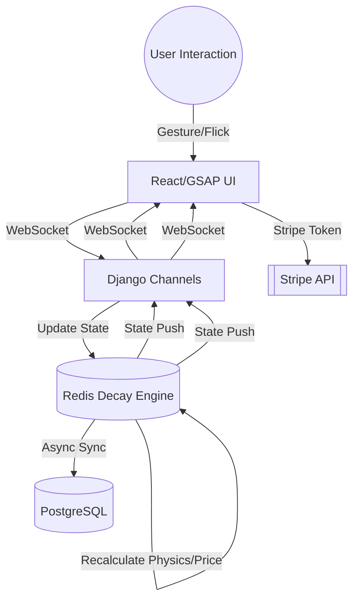

# Architecture Decision Document

_This document builds collaboratively through step-by-step discovery. Sections are appended as we work through each architectural decision together._

## Project Context Analysis

### Requirements Overview

**Functional Requirements:**
The system is built around four immersive clusters. Architecturally, this necessitates a **high-frequency bidirectional sync** between the client-side GSAP physics manifold and the server-side Redis engine. The "Paradox" system requires robust **state snapshotting and rollback mechanisms** to ensure a coherent user experience (visual "Rewind") during transaction failures.

**Non-Functional Requirements:**
Performance is the primary driver, with a strict **<50ms visual latency budget** and **60 FPS** frame rate target. Reliability is managed through **99.9% accurate session recovery from Redis**, while security demands **zero-persistence of payment data**, relying entirely on external tokenization (Stripe).

**Scale & Complexity:**
The project is categorized as **High Complexity** due to the requirement for real-time physics synchronization across a distributed state (Redis to multiple clients).

- Primary domain: Full-stack Web (Real-time Experience)
- Complexity level: High
- Estimated architectural components: 5 (Frontend, WebSocket Layer, Redis Engine, Pricing Worker, API/Admin)

### Technical Constraints & Dependencies
- **Browser Constraints**: Modern Evergreen browsers only; legacy support is explicitly out of scope.
- **State Dependency**: Heavy reliance on **Redis** for sub-200ms state recalculations.
- **Latency Budget**: Global performance constraints dictate the use of WebSockets (Django Channels) as the primary communication protocol.

### Cross-Cutting Concerns Identified
- **Latency Management**: Maintaining visual coherence between physical gestures and server state.
- **Thematic Consistency (Paradox Logic)**: Unified error handling and state rollbacks.
- **Distributed Concurrency**: Using Redis locks to manage inventory atomicity during rapid checkouts.

## Starter Template Evaluation

### Primary Technology Domain
**High-Performance Full-stack Web** based on real-time physics and volatile state requirements.

### Starter Options Considered
- **Vite + React 19 (Frontend Only)**: Highly optimized build pipeline, but requires manual backend integration.
- **Django 6 + Channels 4.3 (Backend Only)**: Best-in-class for real-time WebSockets and Redis integration, but needs a separate frontend build.
- **Next.js 15 (Full-stack)**: Excellent DX, but integrating Django Channels/Redis-First Decay Engine adds unnecessary complexity compared to a pure Python backend.

### Selected Starter: Custom Decoupled (Vite-React + Django-Channels)

**Rationale for Selection:**
To maintain a consistent **60 FPS**, the **Physics Engine must be isolated from the standard E-commerce CRUD logic**. A decoupled architecture allows the frontend to run the physics manifold (GSAP) in a dedicated **Web Worker**, synchronized via a high-frequency **WebSocket pipe** (Django Channels) that bypasses traditional REST/HTTP bottlenecks used for typical CRUD (Product metadata, User Auth).

**Initialization Recommendation:**
- **Frontend**: `npm create vite@latest ./ -- --template react-ts` (React 19, TypeScript)
- **Backend**: `pip install django channels[daphne] redis` (Django 6.0, Channels 4.3)

**Architectural Decisions Provided by Foundation:**
- **Language**: TypeScript (Frontend) / Python 3.12+ (Backend)
- **Styling**: Tailwind CSS 4.0 (for UI stability) + GSAP 3.14 (for physics-driven dynamics).
- **Build Tooling**: Vite for sub-second HMR and optimized asset lazy-loading.
- **Real-Time**: Django Channels + Redis for sub-50ms state propagation.

## Core Architectural Decisions

### Decision Priority Analysis

**Critical Decisions (Block Implementation):**
- **Off-Main-Thread Physics Mirror**: Use of Web Workers is essential to hit the 60 FPS target.
- **MessagePack Serialization**: Binary format required to minimize payload overhead for <50ms packets.
- **Redis Hash State**: Primary store for volatile orbital data for MVP velocity.

**Important Decisions (Shape Architecture):**
- **Lag Compensation Logic**: Robust interpolation required within the Web Worker to handle network jitters.
- **Stripe-Only Payments**: Explicit decision to use zero-persistence PII for compliance and security.

### Data Architecture

- **Primary Volatile Store**: Redis 8.0 (Hashes)
  - *Rationale*: Individual product states (coordinates, mass, price) will be stored as Redis Hashes for O(1) access and update speeds. Simple to implement and extremely fast for high-frequency reads/writes.
- **Persistent Database**: PostgreSQL 17
  - *Rationale*: Standard CRUD (Users, Orders, Product Metadata) and historical price logging.
- **Caching Strategy**: Redis-first for all "Alive UI" components; aggressive PostgreSQL query caching for static metadata.

### Authentication & Security

- **Authentication**: JWT (JSON Web Tokens) with a 15-minute expiry. Required for both REST API and WebSocket handshakes.
- **WebSocket Security**:
  - **Handshake Verification**: JWT validation during the `connect` event.
  - **Origin Control**: Strict enforcement of Allowed Origins to prevent cross-site hijacking of the physics engine.
- **Payment Security (Zero-PII)**: 
  - All transactions use **Stripe Tokenization**. 
  - Only `PaymentMethod` and `PaymentIntent` IDs are processed server-side.
  - No PCI data touches local persistent storage.
- **Atomic Checkout Protocol**:
  - Combines **Redis WATCH** on product state with **PostgreSQL Transactions**.
  - Ensures price freezing and stock decrement are atomic across the distributed system.
  - Failure at any step triggers `ERR_TEMPORAL_PARADOX`.

### API & Communication Patterns

- **High-Frequency Pipe**: WebSockets (Django Channels) + MessagePack.
  - *Rationale*: Binary serialization via MessagePack reduces packet size by ~40% compared to JSON, critical for maintaining the <50ms visual latency budget.
- **Standard CRUD API**: REST (Django REST Framework).
  - *Rationale*: Used for non-time-sensitive actions like user login, product catalog management, and order history.

### Frontend Architecture

- **Physics Isolation (Web Worker)**:
  - **WebSocket Worker**: Manages the persistent socket and deserializes MessagePack packets.
  - **Manifold Worker**: Performs lag compensation and state interpolation.
- **Rendering Layer**: React 19 + GSAP 3.14 (hardware-accel transforms only).
- **State Management**: Zustand for UI state; raw Worker buffers for physics state to avoid React reconciliation overhead for 60FPS visuals.

### Decision Impact Analysis

**Implementation Sequence:**
1. Initialize Vite (React/TS) and Django (Channels/Redis).
2. Implement WebSocket Web Worker with MessagePack support.
3. Build Redis Pricing/Physics Engine (Hashes).
4. Integrate GSAP Manifold with Worker state.
5. Implement Stripe/Checkout CRUD flows.

**Cross-Component Dependencies:**
The **Manifold Worker** is the "single source of truth" for the UI, but it depends entirely on the **Django Channels** stream being alive. Failure in the socket triggers the "Temporal Paradox" (Thematic Rollback) logic immediately.

## Implementation Patterns & Consistency Rules

### Naming Patterns
- **Redis Keys**: Follow the pattern `sc:<domain>:<subdomain>:<id>`.
  - `sc:prod:state:{id}` for volatile physics.
  - `sc:user:cart:{id}` for session-based cart orbits.
- **Database**: `snake_case` for all PostgreSQL tables and columns (Django default).
- **Frontend**: 
  - `PascalCase` for React components.
  - `camelCase` for variables and props.
  - `kebab-case` for file names (e.g., `gravity-well.tsx`, `celestial-product.tsx`).

### Communication Patterns
- **High-Frequency Payloads (Physics)**: Use binary MessagePack with **Short Keys** to minimize packet size.
  - `p`: Position vector
  - `v`: Velocity vector
  - `m`: Communal Mass
  - `t`: Server Timestamp
- **Metadata Payloads (Initial/CRUD)**: Use descriptive keys (e.g., `productId`, `stockLevel`) for clarity and debuggability.
- **Web Worker Interface**: `Command/Event` pattern via `postMessage`.
  - Commands: `type: 'CONNECT'`, `type: 'SEND_GESTURE'`.
  - Events: `type: 'STATE_UPDATE'`, `type: 'ERROR_PARADOX'`.

### Structure Patterns
- **Feature-Based Frontend**: Logic is grouped by feature rather than type. 
  - `src/features/physics/` contains all "noisy" logic (GSAP manifold, orbital math).
  - `src/features/commerce/` contains "boring" logic (catalog, checkout).
- **Decoupled Backend**: 
  - `apps/` for standard Django apps (Auth, Product Metadata).
  - `physics/` for the high-frequency Redis engine.

### Error & Process Patterns
- **The "Temporal Paradox"**: Master error code `ERR_TEMPORAL_PARADOX`.
  - This trigger is responsible for initiating the **Thematic Rollback** (Rewind animation) across the UI.
  - Used for inventory desync, payment failures, or socket disconnects during critical state transitions.
- **Loading States**: `isWarping` for checkout; `isSyncing` for initial orbital sync.

### Project Structure Visualization

```text
SwiftCart/
├── backend/                # Django 6.0 + Channels 4.3
│   ├── apps/               # Modular features (commerce, inventory)
│   ├── physics/            # Core Redis-First Decay Engine
│   │   ├── consumers.py    # WebSocket logic
│   │   └── engine.py       # Physics & Pricing logic
│   └── manage.py
├── frontend/               # Vite + React 19 + TypeScript
│   ├── src/
│   │   ├── features/       # Feature-based organization
│   │   │   ├── physics/    # Gravity Well, Orbits, Flicking
│   │   │   └── commerce/   # Catalog, Hyperdrive Checkout
│   │   ├── workers/        # Off-main-thread physics logic
│   │   │   └── physics.worker.ts
│   │   └── shared/         # Common hooks, components, Utils
│   └── vite.config.ts
└── docs/                   # Standards & Decisions (ADDs, PRD)
```

### Enforcement Guidelines
**All AI Agents MUST:**
- Use the **Physics Mirror** pattern for all real-time visual updates.
- Never write payment logic; always hand off to the `StripeHub` utility.
- Format all binary payloads using the shared `MessagePackSchema` to ensure frontend/backend alignment.


## High-Level System Architecture

SwiftCart utilizes a high-frequency, event-driven architecture designed to support real-time physics and dynamic pricing with sub-50ms visual latency. The system is split into three primary layers: the **React/GSAP "Alive UI"**, the **Django Channels WebSocket Layer**, and the **Redis-First Decay Engine**.

### 1. Redis-First Decay Engine (The Heartbeat)
The core logic resides in a high-performance Redis implementation that manages the volatile state of all products in the "Gravity Well."
- **Physics Calculations**: Redis handles sub-50ms recalculations of orbital coordinates, velocities, and communal mass state.
- **Price Decay**: A specialized worker process monitors interaction frequency and inventory, updating decayed prices directly in Redis at <200ms intervals.
- **Atomicity**: Distributed locks and atomic operations ensure that price freezing (during Hyperdrive Checkout) and inventory decrements are consistent.

### 2. Django Channels (Real-Time Synchronization)
Django Channels serves as the persistent communication bridge between the backend state and the frontend interface.
- **WebSocket Streams**: High-frequency packets (positions, rotations, stock glitches) are pushed from Redis through Channels to active client sessions.
- **Minimal Overhead**: The WebSocket layer bypasses traditional HTTP overhead to meet the <50ms latency budget for visual state updates.
- **State Partitioning**: Channels manages session-specific data (Personal Cart Orbits) while broadcasting communal state changes (Global Mass/Price Decay).

### 3. React/GSAP Frontend (The Physics Manifold)
The frontend is responsible for translating backend state into an immersive, tactile experience.
- **GSAP Physics Engine**: Rather than simple animations, GSAP is used as a physics manifold. It interpolates incoming WebSocket data to create smooth, high-60FPS movements even with slight network jitter.
- **Redshift Glitch UI**: React state-driven components trigger CSS/JS glitches based on "instability" variables pushed via the WebSocket.
- **Gesture Interaction**: "Flick-to-Orbit" and "Tractor-Beam" gestures are captured on the client, processed via GSAP for immediate feedback, and synced back to Redis via the WebSocket for communal mass updates.

### Data Flow Diagram (Conceptual)


## Data Architecture

### 1. Persistent Layer (PostgreSQL)
The persistent layer handles core business logic, user management, and historical state.

| Model | Key Fields | Purpose |
| :--- | :--- | :--- |
| **Product** | `uuid`, `slug`, `msrp`, `base_mass` | Master catalog and initial physics variables. |
| **Inventory** | `product_id`, `stock_count`, `reserved_count` | Atomic stock tracking with optimistic reservations. |
| **Order** | `id`, `user_id`, `total_price`, `stripe_intent_id` | Transactional integrity for checkouts. |

### 2. Volatile Layer (Redis Hashes)
High-frequency physics and pricing state are stored in Redis Hashes for sub-50ms access.

**Key Pattern**: `sc:prod:state:{uuid}`

| Field | Type | Description |
| :--- | :--- | :--- |
| `p_x, p_y, p_z` | Float | Orbital position vectors. |
| `v_x, v_y, v_z` | Float | Velocity vectors for lag compensation. |
| `m` | Float | **Communal Mass**: Increases with user interaction/orbits. |
| `g` | Float | Local gravity coefficient (Mass-dependent). |
| `price_current` | Decimal | The real-time decayed price (Driven by mass/time). |

### 3. Sync & Integrity Mechanism

- **Cold Boot**: When the system starts, a management task populates Redis Hashes from the `Product` table.
- **State Capture**: During "Hyperdrive" checkout, the absolute price is read from `price_current` (Redis) and written to the `OrderItem` (PostgreSQL).
- **Paradox Recovery**: If Redis state is lost, the system falls back to `msrp` (PostgreSQL) and resets physics vectors, triggering a thematic `ERR_TEMPORAL_PARADOX` UI reset.

## Summary & Sign-off

The SwiftCart architecture is a dual-engine system designed for immersive, real-time e-commerce. By decoupling high-frequency physics (Redis/WebWorkers) from transactional business logic (PostgreSQL/Django), we achieve the necessary <50ms visual latency without sacrificing data integrity.

### Key Architectural Pillars
- **Performance**: Redis-first volatility with off-main-thread physics manifolds.
- **Security**: Zero-PII Stripe tokenization and JWT-guarded WebSocket channels.
- **Consistency**: Atomic cross-store protocols (Redis Watch + DB Transactions).
- **Theme**: Error handling treated as "Temporal Paradoxes" with unified visual rollbacks.

**Status**: [Finalized] 2026-02-13
