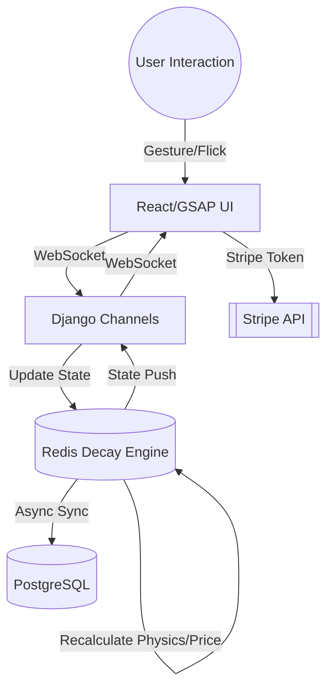

# Architecture Decision Document

_This document builds collaboratively through step-by-step discovery. Sections are appended as we work through each architectural decision together._

## Project Context Analysis

### Requirements Overview

**Functional Requirements:**
The system is built around four immersive clusters. Architecturally, this necessitates a **high-frequency bidirectional sync** between the client-side GSAP physics manifold and the server-side Redis engine. The "Paradox" system requires robust **state snapshotting and rollback mechanisms** to ensure a coherent user experience (visual "Rewind") during transaction failures.

**Non-Functional Requirements:**
Performance is the primary driver, with a strict **<50ms visual latency budget** and **60 FPS** frame rate target. Reliability is managed through **99.9% accurate session recovery from Redis**, while security demands **zero-persistence of payment data**, relying entirely on external tokenization (Stripe).

**Scale & Complexity:**
The project is categorized as **High Complexity** due to the requirement for real-time physics synchronization across a distributed state (Redis to multiple clients).

- Primary domain: Full-stack Web (Real-time Experience)
- Complexity level: High
- Estimated architectural components: 5 (Frontend, WebSocket Layer, Redis Engine, Pricing Worker, API/Admin)

### Technical Constraints & Dependencies
- **Browser Constraints**: Modern Evergreen browsers only; legacy support is explicitly out of scope.
- **State Dependency**: Heavy reliance on **Redis** for sub-200ms state recalculations.
- **Latency Budget**: Global performance constraints dictate the use of WebSockets (Django Channels) as the primary communication protocol.

### Cross-Cutting Concerns Identified
- **Latency Management**: Maintaining visual coherence between physical gestures and server state.
- **Thematic Consistency (Paradox Logic)**: Unified error handling and state rollbacks.
- **Distributed Concurrency**: Using Redis locks to manage inventory atomicity during rapid checkouts.

## High-Level System Architecture

SwiftCart utilizes a high-frequency, event-driven architecture designed to support real-time physics and dynamic pricing with sub-50ms visual latency. The system is split into three primary layers: the **React/GSAP "Alive UI"**, the **Django Channels WebSocket Layer**, and the **Redis-First Decay Engine**.

### 1. Redis-First Decay Engine (The Heartbeat)
The core logic resides in a high-performance Redis implementation that manages the volatile state of all products in the "Gravity Well."
- **Physics Calculations**: Redis handles sub-50ms recalculations of orbital coordinates, velocities, and communal mass state.
- **Price Decay**: A specialized worker process monitors interaction frequency and inventory, updating decayed prices directly in Redis at <200ms intervals.
- **Atomicity**: Distributed locks and atomic operations ensure that price freezing (during Hyperdrive Checkout) and inventory decrements are consistent.

### 2. Django Channels (Real-Time Synchronization)
Django Channels serves as the persistent communication bridge between the backend state and the frontend interface.
- **WebSocket Streams**: High-frequency packets (positions, rotations, stock glitches) are pushed from Redis through Channels to active client sessions.
- **Minimal Overhead**: The WebSocket layer bypasses traditional HTTP overhead to meet the <50ms latency budget for visual state updates.
- **State Partitioning**: Channels manages session-specific data (Personal Cart Orbits) while broadcasting communal state changes (Global Mass/Price Decay).

### 3. React/GSAP Frontend (The Physics Manifold)
The frontend is responsible for translating backend state into an immersive, tactile experience.
- **GSAP Physics Engine**: Rather than simple animations, GSAP is used as a physics manifold. It interpolates incoming WebSocket data to create smooth, high-60FPS movements even with slight network jitter.
- **Redshift Glitch UI**: React state-driven components trigger CSS/JS glitches based on "instability" variables pushed via the WebSocket.
- **Gesture Interaction**: "Flick-to-Orbit" and "Tractor-Beam" gestures are captured on the client, processed via GSAP for immediate feedback, and synced back to Redis via the WebSocket for communal mass updates.

### Data Flow Diagram (Conceptual)

